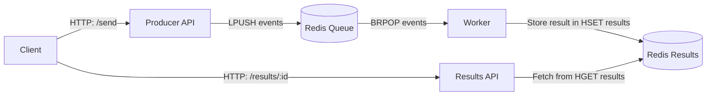

# Event-Driven Go Application with Redis Queue

This project demostrates a simple event-driven architecture written in **GO**, using **Redis** as a message queue and **HTTP** microservices for producing, processing, and retrieving results.

The system is designed to show:

- Event queuing
- Backpressure
- Asynchronous background processing
- Result polling
- Horizontal scalability

It uses three services:

1. **Producer** API - accepts events from clients, assigns an event ID, and enqueues the event
2. **Worker** - consumes events from Redis, simulates heavy work, stores results
3. **Results** API - allows clients to retrieve the output by event ID

## Table of Contents

 -[Architecture Overview](#-architecture-overview)
 -[Components](#-components)
 -[End-to-End Flow](#-end-to-end-flow)
 -[Local Development](#-local-development)
 -[Local Testing](#-local-testing)
 -[Kubernetes Deployment)(#-kubernetes-deployment)

## Architecture Overview



## 📦 Components

1. **Producer Service**

 - Accepts `msg` via `GET /send?msg=...`
 - Generates unique event IDs
 - Pushes serialized events into Redis list `events`
 - Returns the event ID immediately (non-blocking)

 **Example response**:
 ```json
  {"event_id":"7d2f2c1f-6b4a-4bfa-8a64-915d17be612c"}
 ```

2. **Worker Service**

 - Blocks on Redis using `BRPOP`

 - Deserializes the event

 - Simulates heavy work (`time.Sleep(30s)` for demonstration)

 - Stores structured results into Redis hash `results`

**Worker stores**:
```json
 {
   "id": "...",
   "message": "your message",
   "status": "done",
   "output": "Processed: your message"
 }
```

3. **Results API**

 - Exposes `GET /results/<id>`

 - If result not ready → returns `404 not ready`

 - If ready → returns JSON payload
 ----

## 🔁 End-to-End Flow

1. **Client sends an event**

```
   GET /send?msg=Hello
```

**Producer**:

 - Wraps message in a struct

 - Assigns UUID

 - Pushes JSON into Redis list `events`
 ---

2. **Worker processes event**

 - Waits using `BRPOP` (blocks until event exists)

 - Performs work (e.g., 30s simulated workload)

 - Writes result to Redis hash `results`

3. **Client polls results**

```
  GET /results/<event_id>
```

**Results API**:

 - Checks Redis

 - Returns JSON or “not ready”
 ---

## Local Development

You can run everything locally using Go and a local Redis server.

**Start Redis**
```bash
  redis-server
```

**Run Producer**
```bash
  REDIS_ADDR=localhost:6379 go run producer/main.go
```

**Run Worker**
```bash
  REDIS_ADDR=localhost:6379 go run worker/main.go
```

**Run Results API**
```bash
  REDIS_ADDR=localhost:6379 go run results/main.go
```
---

## 🧪 Local Testing

1. **Send an event**
```bash
  curl "http://localhost:8080/send?msg=Hello"
```

**Returns**:
```json
{"event_id":"abc123..."}
```

2. **Check result**
```bash
  curl http://localhost:8082/results/abc123
```


**Before processing**:
```
 not ready
```


**After ~30 seconds**:
```json
{
  "id": "abc123",
  "message": "Hello",
  "status": "done",
  "output": "Processed: Hello"
}
```
---

## ☸ Kubernetes Deployment

**The repo includes**:

 - `manifests/redis.yaml`

 - `manifests/producer.yaml`

 - `manifests/worker.yaml`

 - `manifests/results.yaml`

**Apply everything**:
```bash
  kubectl apply -f k8s/
```


**Get external IPs for testing**:
```bash
  kubectl get svc
```

Then test the same flow using NodePort addresses.

