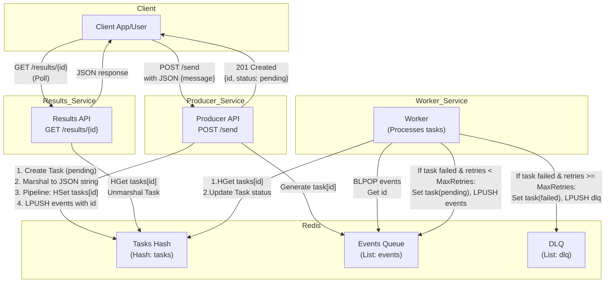

# Go Redis Queue 

A task simulation queue written in **GO** to create **REST** APIs, and using **Redis** as a lightweight message broker and key-value store in this event-driven architecture project for producing, processing, and retrieving tasks.
The system is designed to show:

- Event queuing
- Backpressure
- Asynchronous background processing
- Result polling
- Horizontal scalability

It uses four services:

1. **Producer** API - accepts tasks from clients, assigns a unique task ID, and enqueues the task
2. **Worker** - consumes tasks from Redis, simulates work, updates task info
3. **Results** API - allows clients to retrieve the task data by task ID
4. **Redis** - serves as lightweight message broker and a key-value store

## Table of Contents

 - [Architecture Overview](#architecture-overview)
 - [Components](#components)
 - [Local Development](#local-development)
 - [Local Testing](#local-testing)
 - [Kubernetes Deployment](#kubernetes-deployment)

## Architecture Overview


```mermaid
flowchart TB
 subgraph Client["Client"]
        C["Client App/User"]
  end
 subgraph Producer_Service["Producer_Service"]
        P["Producer API<br>POST /send"]
  end
 subgraph Results_Service["Results_Service"]
        R["Results API<br>GET /results/{id}"]
  end
 subgraph Redis["Redis"]
        H["Tasks Hash<br>(Hash: tasks)"]
        Q["Events Queue<br>(List: events)"]
        D["DLQ<br>(List: dlq)"]
  end
 subgraph Worker_Service["Worker_Service"]
        W["Worker<br>(Processes tasks)"]
  end
    C -- POST /send<br>with JSON {message} --> P
    C -- GET /results/{id}<br>(Poll) --> R
    P -- "1. Create Task (pending)<br>2. Marshal to JSON string<br>3. Pipeline: HSet tasks[id]<br>4. LPUSH events with id" --> H
    P -- Generate task[id] --> Q
    P -- 201 Created<br>{id, status: pending} --> C
    R -- HGet tasks[id]<br>Unmarshal Task --> H
    R -- JSON response--> C
    W -- BLPOP events<br>Get id --> Q
    W -- "1.HGet tasks[id]<br>2.Update Task status" --> H
    W -- If task failed &amp; retries &lt; MaxRetries:<br>Set task(pending), LPUSH events --> Q
    W -- "If task failed &amp; retries &gt;= MaxRetries:<br>Set task(failed), LPUSH dlq" --> D
```

## Components

1. **Producer Service**

 - Accepts `msg` via `POST /send` with 
  ```json
  {"message": "test"}
  ```
 - Generates unique event IDs
 - Pushes serialized events into Redis list `events`
 - Returns HTTP 201 with
 ```json
  {"id":"...","status":"pending"}
```

2. **Worker Service**

 - Accesses task from Redis Tasks Hash

 - Updates task status

 - Simulates work (`time.Sleep(30s)` for demonstration)

 - Simulates task processing updating task's status with processing, failed or done

 - Retries processing failed tasks within a certain limit

 - Stores the failed task into Redis list `dlq`

3. **Results API**

 - Exposes `GET /results/<id>`

 - If result not ready → returns 

**Polling Task during processing**:
```json
{
    "id":"...",
    "message":"test",
    "created_at":"2025-11-01T13:16:30Z",
    "started_at":"2025-11-01T13:17:30Z",
    "status":"processing",
    "error":"Simulated processing failure",
    "retries":2
} 
```

 - If ready → returns 

**Successful Task example**:
```json
 {
     "id":"...",
     "message":"test",
     "created_at":"2025-11-01T13:16:30Z",
     "started_at":"2025-11-01T13:17:30Z",
     "completed_at":"2025-11-01T13:18:00Z",
     "status":"done",
     "output":"Processed: test",
     "retries":2
 } 
```

---

## Local Development

You can run everything locally using Go and a local Redis server.

**Start Redis**
```bash
  redis-server
```

**Run Producer**
```bash
  REDIS_ADDR=localhost:6379 go run producer/main.go
```

**Run Worker**
```bash
  REDIS_ADDR=localhost:6379 go run worker/main.go
```

**Run Results API**
```bash
  REDIS_ADDR=localhost:6379 go run results/main.go
```
---

## Local Testing

1. **Send an event**
```bash
  curl -X -H "Content-Type: application/json" -d '{"message": "test"}' http://localhost:8080/send
```

**Returns**:
```json
  {"id":"...","status":"pending"}
```

2. **Check result**
```bash
  curl http://localhost:8082/results/<id>
```


**During processing**:
```json
{
    "id":"...",
    "message":"test",
    "created_at":"2025-11-01T13:16:30Z",
    "started_at":"2025-11-01T13:17:30Z",
    "status":"processing",
    "error":"Simulated processing failure",
    "retries":2
} 
```


**After completion**:
```json
 {
     "id":"...",
     "message":"test",
     "created_at":"2025-11-01T13:16:30Z",
     "started_at":"2025-11-01T13:17:30Z",
     "completed_at":"2025-11-01T13:18:00Z",
     "status":"done",
     "output":"Processed: test",
     "retries":2
 } 
```
---

## Kubernetes Deployment

**The repo includes**:

 - `k8s/redis.yaml`

 - `k8s/producer.yaml`

 - `k8s/worker.yaml`

 - `k8s/results.yaml`

**Apply files to the cluster**:
```bash
  kubectl apply -f k8s/
```


**Get external IPs for testing**:
```bash
  kubectl get svc
```

Then test the same flow using NodePort addresses.

